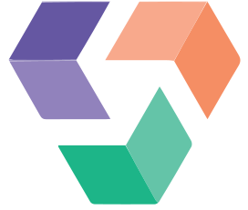

# VBLX — Visionblox Enterprise Platform

<p align="center">
  
</p>

<p align="center">
  <strong>The Operating System for Enterprise Operations</strong><br>
  <em>Software for operational intelligence, procurement, and compliance. We build tools for institutions.</em>
</p>

<p align="center">
  <a href="https://visionblox.com">Website</a> •
  <a href="#products">Products</a> •
  <a href="#tech-stack">Tech Stack</a> •
  <a href="#getting-started">Getting Started</a> •
  <a href="#deployment">Deployment</a>
</p>

<p align="center">
  
  
  
  
  
</p>

---

## Overview

VBLX is the next-generation web presence for **Visionblox LLC**, a minority-owned technology consultancy specializing in AI-driven federal solutions, healthcare IT modernization, and enterprise cloud migration.

This repository contains the Palantir-inspired redesign that transforms Visionblox from an IT services provider into an **enterprise operating system builder**—positioning three unified platforms at the core of the company's market presence.

### Design Philosophy

- **Operational Gravity**: Dark themes, restrained color palettes, precise typography
- **Product Excellence**: Comprehensive product suite for enterprise operations
- **Technical Authority**: Deep documentation, architectural depth over marketing abstractions
- **Mission Alignment**: "We build software for institutions."

---

## Products

Our product suite delivers enterprise-grade solutions across key operational domains:

| Product | Category | Description |
|---------|----------|-------------|
| **Pro-Sales** | CRM Excellence | Revolutionize sales process management and customer relationships |
| **Pro-Biz** | Business Intelligence | Drive strategic decisions with powerful analytics |
| **Pro-People** | Workforce Management | Intelligent HR and people management solutions |
| **Pro-Project** | Project Management | Deliver projects on time and budget |
| **Pro-Task** | Task Automation | Streamline workflows with intelligent automation |
| **Pro-Ticket** | Service Management | Exceptional customer service and support |
| **Pro-Visit** | Visitor Management | Secure and streamline facility access |
| **Pro-Assure** | Quality Assurance | Comprehensive warranty and quality management |
| **Pro-Pupil** | Education Management | Transform educational administration |
| **DocSnip** | Document Intelligence | Effortless data extraction and management |

---

## Tech Stack

| Layer | Technology | Purpose |
|-------|------------|---------|
| **Framework** | Next.js 14 (App Router) | SSG/SSR, API routes, edge functions |
| **Language** | TypeScript 5.3 | Type safety, developer experience |
| **Styling** | Tailwind CSS 3.4 | Utility-first, design tokens |
| **Animation** | Framer Motion 11 | Page transitions, micro-interactions |
| **Icons** | Lucide React | Consistent iconography |
| **Hosting** | Vercel | Edge CDN, auto-deploy, preview URLs |
| **CMS** | Sanity v3 | Headless content management |

---

## Getting Started

### Prerequisites

- Node.js 18.17+ 
- npm or yarn

### Installation

```bash
# Clone the repository
git clone https://github.com/kwoodensr/vblx.git
cd vblx

# Install dependencies
npm install

# Start development server
npm run dev
```

Open [http://localhost:3000](http://localhost:3000) in your browser.

### Sanity Studio Setup

1. Create a Sanity project at [sanity.io/manage](https://www.sanity.io/manage)
2. Copy your project ID and dataset name
3. Add to `.env.local`:

```env
NEXT_PUBLIC_SANITY_PROJECT_ID=your-project-id
NEXT_PUBLIC_SANITY_DATASET=production
NEXT_PUBLIC_SANITY_API_VERSION=2024-01-01
```

4. Access the studio at [http://localhost:3000/studio](http://localhost:3000/studio)

### Scripts

| Command | Description |
|---------|-------------|
| `npm run dev` | Start development server |
| `npm run build` | Build for production |
| `npm run start` | Start production server |
| `npm run lint` | Run ESLint |

---

## Project Structure

```
vblx/
├── app/
│   ├── globals.css          # Design system + CSS variables
│   ├── layout.tsx           # Root layout with fonts
│   ├── page.tsx             # Homepage
│   ├── products/            # Product pages
│   ├── services/            # Service pages
│   ├── industries/          # Industry pages
│   ├── case-studies/        # Case study pages
│   ├── contact/             # Contact forms (commercial, federal)
│   └── studio/              # Sanity Studio (embedded)
├── components/
│   ├── ui/                  # Reusable components
│   ├── layout/              # Layout components
│   └── sections/            # Page sections
├── lib/
│   ├── utils.ts             # Utilities + constants
│   ├── productsData.ts      # Product content data
│   ├── servicesData.ts      # Services content data
│   ├── industriesData.ts    # Industries content data
│   └── caseStudiesData.ts   # Case studies data
├── sanity/
│   ├── schemaTypes/         # Content schemas
│   └── lib/                 # Client + queries
├── public/                  # Static assets
├── sanity.config.ts         # Sanity configuration
├── tailwind.config.ts       # Tailwind configuration
└── package.json
```

---

## Design System

### Colors

| Token | Value | Usage |
|-------|-------|-------|
| `--color-bg-primary` | `#0D0D0D` | Main backgrounds |
| `--color-bg-secondary` | `#1A1A1A` | Cards, sections |
| `--color-accent-primary` | `#00D4AA` | CTAs, highlights |
| `--color-accent-secondary` | `#3B82F6` | Links, secondary |

### Typography

| Type | Font | Usage |
|------|------|-------|
| Display | Space Grotesk | Heroes, large headings |
| Sans | Inter | Body text, UI elements |
| Mono | JetBrains Mono | Code, technical content |

---

## Deployment

### Vercel (Recommended)

1. Push to GitHub
2. Import repository at [vercel.com/new](https://vercel.com/new)
3. Deploy automatically

```bash
# Or deploy via CLI
npx vercel
```

### Environment Variables

Create `.env.local` for local development:

```env
# Analytics (optional)
NEXT_PUBLIC_GA_ID=UA-XXXXXXXX-X

# CRM Integration (optional)
CRM_WEBHOOK_URL=https://your-crm-endpoint
```

---

## Roadmap

- [x] **Phase 1**: Foundation — Design system, components, homepage
- [x] **Phase 2**: Product pages — Product suite detail pages
- [x] **Phase 3**: Intake forms — Commercial + Federal/SLED lead capture
- [x] **Phase 4**: Content depth — Case studies, industries, services
- [x] **Phase 5**: CMS integration — Sanity headless CMS *(embedded studio at /studio)*
- [x] **Phase 6**: Analytics — Conversion tracking, A/B testing

---

## Company

**Visionblox LLC**

| Attribute | Value |
|-----------|-------|
| **CAGE Code** | 9Z4X2 |
| **UEI** | H4X2Z7R9E3E3 |
| **Status** | Minority-Owned, GSA MAS Springboard |
| **Headquarters** | San Jose, CA |

### Global Presence

- 🇺🇸 San Jose, CA (HQ)
- 🇺🇸 Philadelphia, PA
- 🇴🇲 Muscat, Oman
- 🇦🇪 Dubai, UAE
- 🇮🇳 Chennai, India

---

## Contact

**Khaalis Wooden, MBA** — Director of Enterprise Capture & Compliance

- Email: [khaalis.wooden@visionblox.com](mailto:khaalis.wooden@visionblox.com)
- Phone: +1 (210) 429-4227
- LinkedIn: [Visionblox](https://www.linkedin.com/company/100849749/)

---

## License

Proprietary. © 2025 Visionblox LLC. All rights reserved.

---

<p align="center">
  <strong>Visionblox</strong> — We build the operating systems that power enterprise operations.<br>
  <em>From data to decision. From complexity to clarity.</em>
</p>
